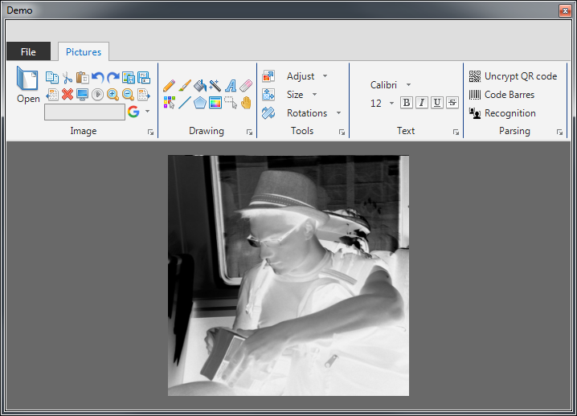

# Image library : tools to modify / analyse pictures [](http://servodroid.com)

All tools to modify image (resize, crop, change in gray, draw on it, ...) and analyse it (face recognition, qr code and barecode decrypt, ...)

[](https://www.nuget.org/packages/Manager-Image/)
[](https://raw.githubusercontent.com/ThibaultMontaufray/Tools4Libraries/master/License)
[](https://travis-ci.org/ThibaultMontaufray/Manager-Image) 
[](https://ci.appveyor.com/project/ThibaultMontaufray/manager-Image)
[](https://codeclimate.com/github/ThibaultMontaufray/Manager-Image)
[](https://coveralls.io/r/ThibaultMontaufray/Manager-Image?branch=master)

# Example in demo

```csharp
 Application.Run(new Droid_Image.Demo());
```

